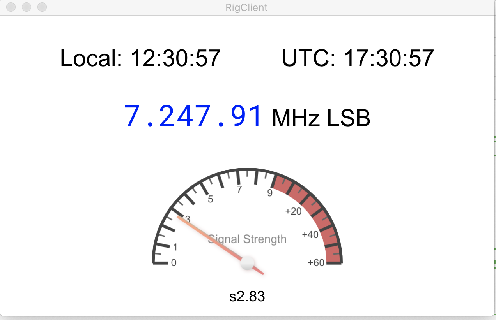

# python-rig-client

A Python and py-webview re-implementation of https://github.com/rfreedman/rig-client
which was based on Electron.

Displays a "dashboard" for an HF ham radio, displaying the current local and UTC time,
the radio's VFO frequency, and the recieved signal strength as a radial gauge.

The app works with the HamLib 'rigctl' or 'rigctld' CAT control programs: https://hamlib.sourceforge.net/html/rigctl.1.html

HamLib/rigctl(d) presents a text-command interface via tcp/ip, so this program can be run anywhere that can reach the computer
that is running rigctl(d) and is connected to the radio to be monitored.

